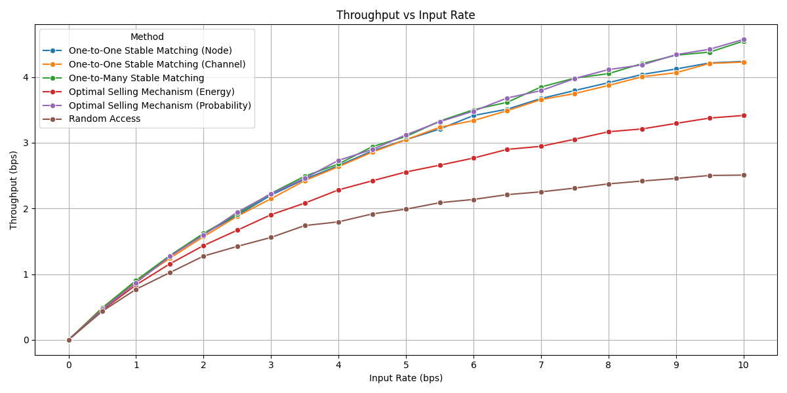

# Game-Theory-Course-Project

This project is a simulation study for a game theory course, focusing on different matching protocols and their impact on network throughput. The project implements and compares several protocols, including One-to-One Stable Matching, One-to-Many Stable Matching, and Optimal Selling Mechanisms.

## Table of Contents

- [Introduction](#introduction)
- [Implementation](#implementation)
- [Protocols Implemented](#protocols-implemented)
- [Simulation Results](#simulation-results)

## Introduction

The goal of this project is to simulate and analyze various matching protocols in a networked environment. The protocols are tested on a network with multiple nodes, and the throughput is measured against different input rates.

## Implementation

To main content of the simulation is in the `Project.ipynb` file, The protocols were implemented in the `protocols` module, and the network simulation was performed using the Network class from the `components` module, which contains all the codes for the components of the simulation such as the `Node`, `Channel` and `Network` classes.:

## Protocols Implemented

### One-to-One Stable Matching

Implements the stable matching algorithm for a one-to-one matching scenario. Two modes are available:

- **Node:** Nodes propose to channels.
- **Channel:** Channels propose to nodes.

### One-to-Many Stable Matching

Implements a stable matching algorithm allowing channels to match with multiple nodes, up to a specified maximum number of matches per channel.

### Optimal Selling Mechanism

Implements an optimal selling mechanism based on:

- **Energy:** Matches nodes to channels based on their energy levels.
- **Probability:** Matches nodes to channels based on the probability of successful data transmission.

## Simulation Results

The simulation results show the throughput against the input rate for the different protocols. Below is a sample plot generated by the simulation:

the main results are also contained in the `results.csv` file.